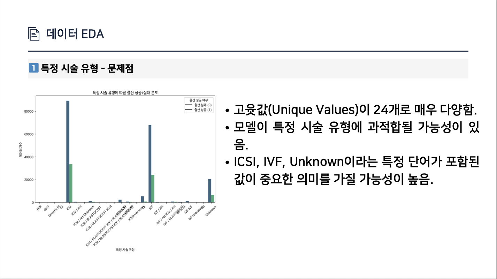
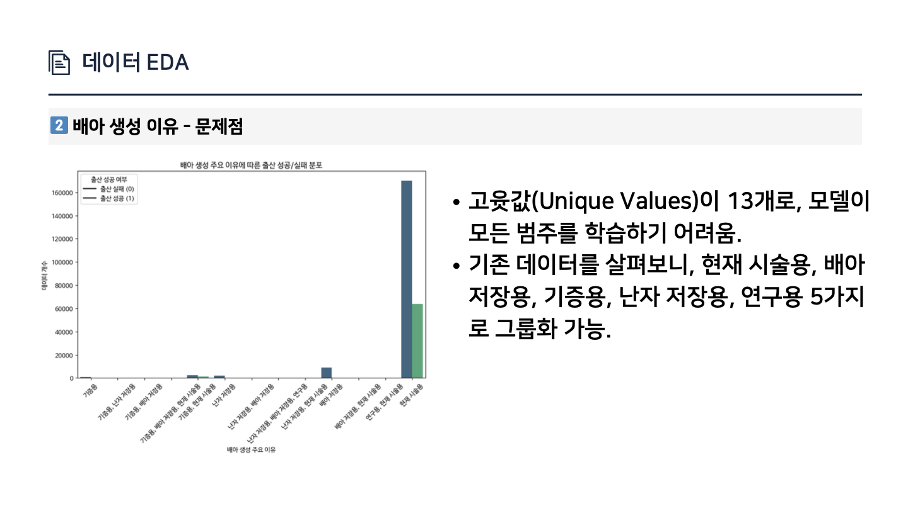
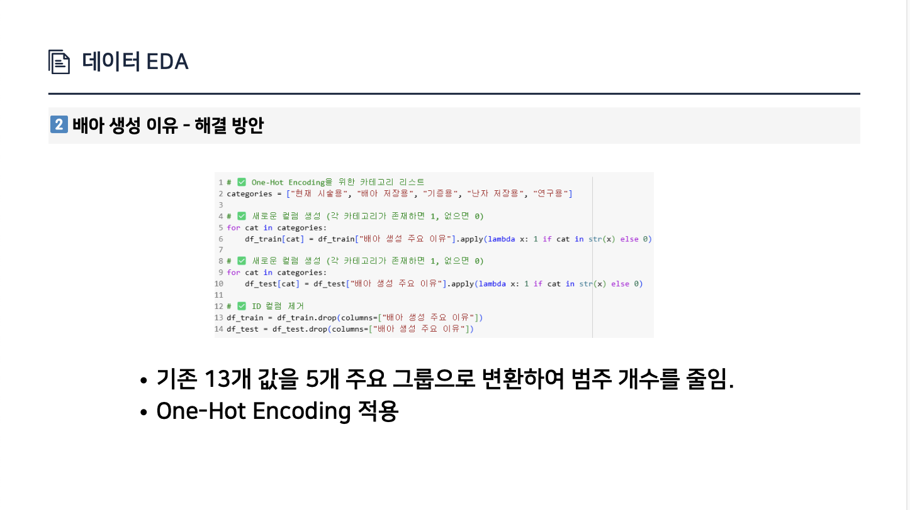
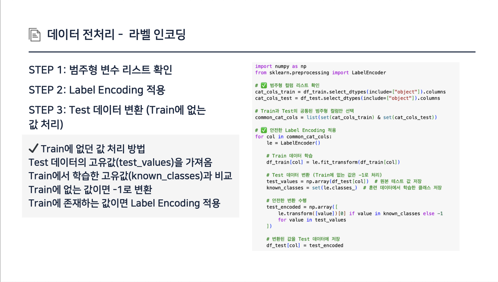
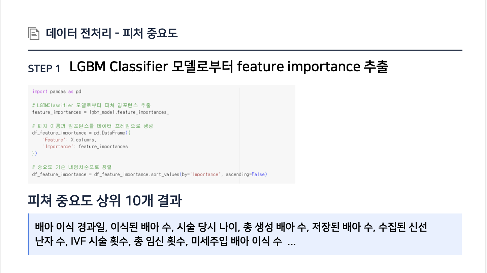
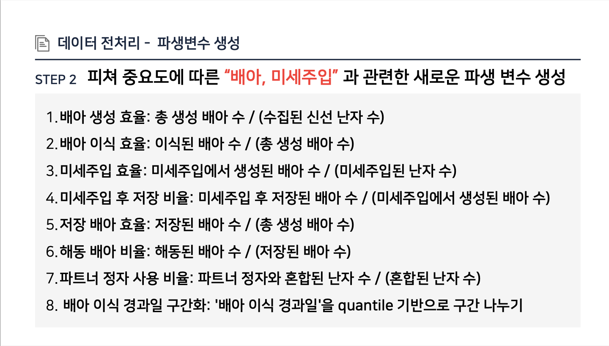
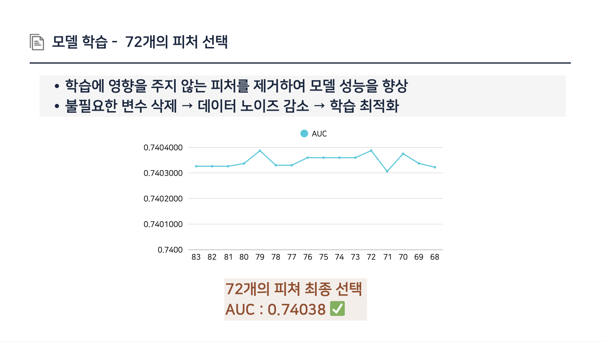
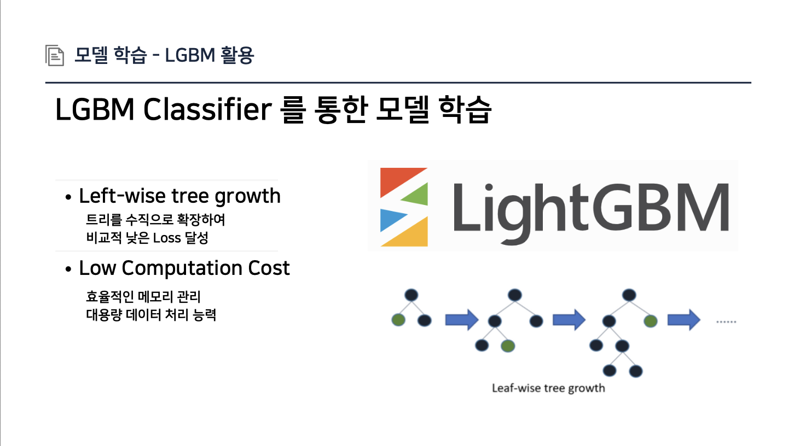
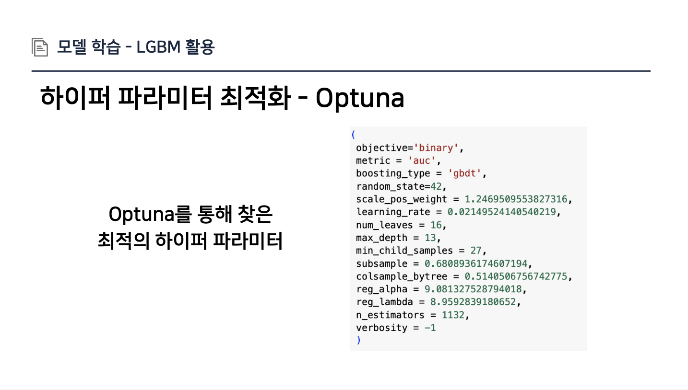
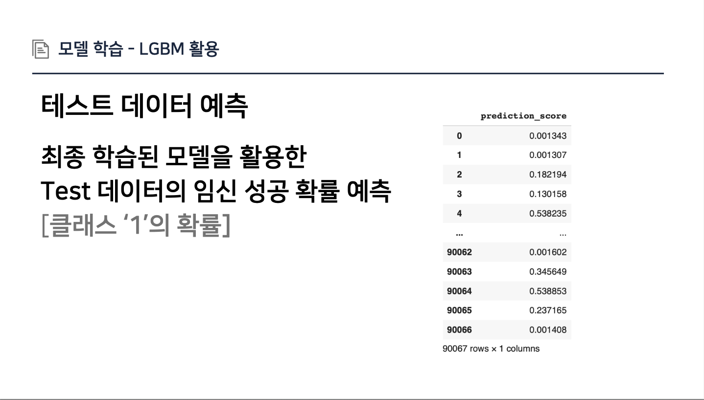

<div align="center">

# 🧬 난임 환자 대상 임신 성공 여부 예측 🧬

</div>

## 🏁 대회 개요
### 1. 배경
   난임은 전 세계적으로 증가하는 중요한 의료 문제로, 많은 부부들이 오랜 기간 동안 신체적, 정신적 부담을 겪고 있습니다. 난임 시술을 진행하는 환자들은 치료 과정에서 높은 비용과 심리적 스트레스를 경험하기 때문에, 최소한의 시술로 임신 성공 가능성을 높이는 것이 매우 중요합니다.

### 2. 주제
  난임 환자 대상 임신 성공 여부 예측 AI 모델 개발
  
### 3. 규칙
Train 데이터 : ID, 난임 환자 시술 데이터(67개의 컬럼), 임신 성공 여부(0: 실패, 1: 성공)
Test 데이터 : ID, 난임 환자 시술 데이터(67개의 컬럼)

---

## 📊 데이터 EDA
### 📌 범주형 변수 처리
유니크 개수가 10개 이상인 Feature 다수 존재

• 대표적으로 배아 생성 이유(13개), 특정 시술 유형(24개) <br>
• 범주 개수가 너무 많아 모델 학습 시 문제 발생 가능성 높음

| Feature명           | 고유 값 개수 | 예시 값 |
|--------------------|--------------|---------|
| 특정 시술 유형       | 24개         | ICSI, IVF, Unknown, IUI, IVF:IVF, ... |
| 배란 유도 유형       | 4개          | 기록되지 않은 시행, 알 수 없음, 세트로타이드 등 |
| 배아 생성 주요 이유   | 13개         | 현재 시술용, 난자 저장용, 배아 저장용, 기증용, 연구용 등 |

### 🔧 특정 시술 유형 처리 - 해결 방안

특정 시술 유형(Feature: `특정 시술 유형`)의 고유 값이 많고, 복합적으로 기입된 경우가 있어  
주요 시술인 `ICSI`, `IVF`, `Unknown`의 포함 여부를 파악하는 **파생 변수**를 생성했습니다.

### ✅ 파생 변수 생성 코드

```python
# Train 데이터 처리
df_train["check_ICSI"] = df_train["특정 시술 유형"].str.contains("ICSI", na=False).astype(int)
df_train["check_IVF"] = df_train["특정 시술 유형"].str.contains("IVF", na=False).astype(int)
df_train["check_Unknown"] = (df_train["특정 시술 유형"].str.strip() == "Unknown").astype(int)

# Test 데이터 처리
df_test["check_ICSI"] = df_test["특정 시술 유형"].str.contains("ICSI", na=False).astype(int)
df_test["check_IVF"] = df_test["특정 시술 유형"].str.contains("IVF", na=False).astype(int)
df_test["check_Unknown"] = (df_test["특정 시술 유형"].str.strip() == "Unknown").astype(int)

# 기존 컬럼 제거
df_train = df_train.drop(columns=["특정 시술 유형"])
df_test = df_test.drop(columns=["특정 시술 유형"])

```
### ✅ 새로 생성된 파생 변수
**check_ICSI** :	특정 시술 유형에 "ICSI"가 포함되면 1, 아니면 0 <br>
**check_IVF** :	특정 시술 유형에 "IVF"가 포함되면 1, 아니면 0<br>
**check_Unknown** :	특정 시술 유형 값이 "Unknown"이면 1, 아니면 0





---

## 🧹 데이터 전처리




---

## ⚙️ 모델링 및 학습

  


---

## 📈 성능 결과

|               | Public     | Private |
|----------------|------------|------------|
| **AUC Score**  | **0.74218** | **0.74218** |
| **Rank**       | **13th**     | **33th**    |

---

## 🙌 팀원 소개
- 🧑‍💻 이원우  
- 🧑‍💻 손영진  
- 🧑‍💻 이단비
