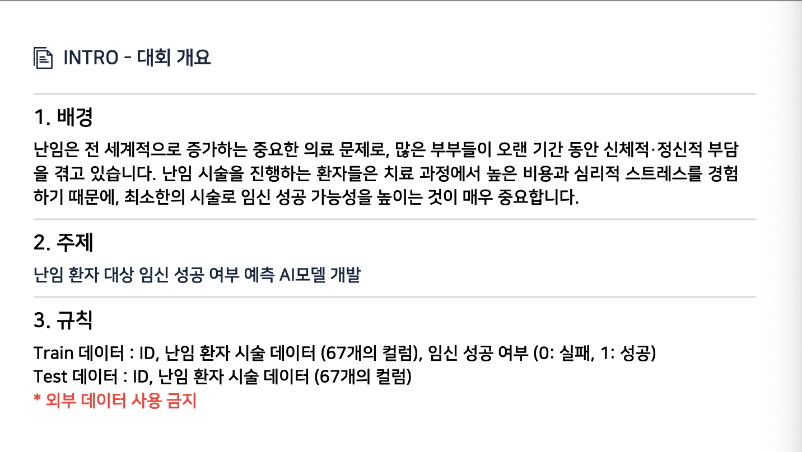
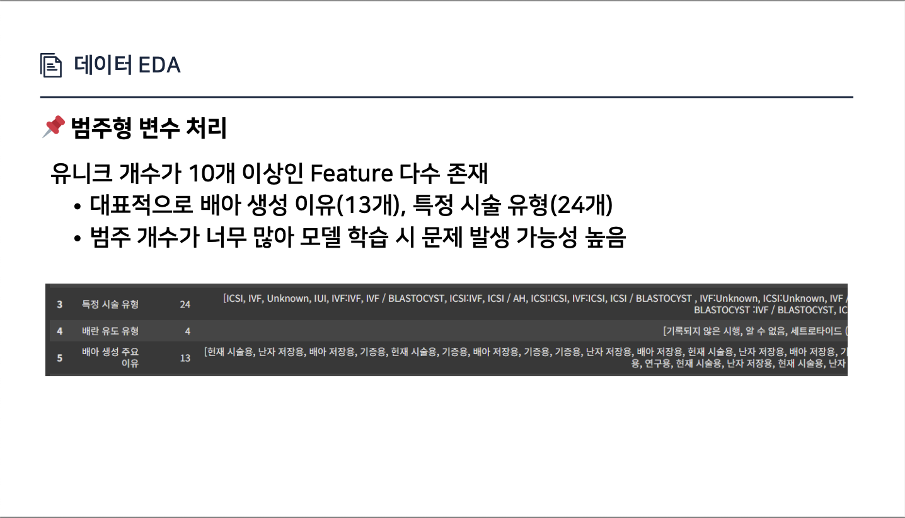
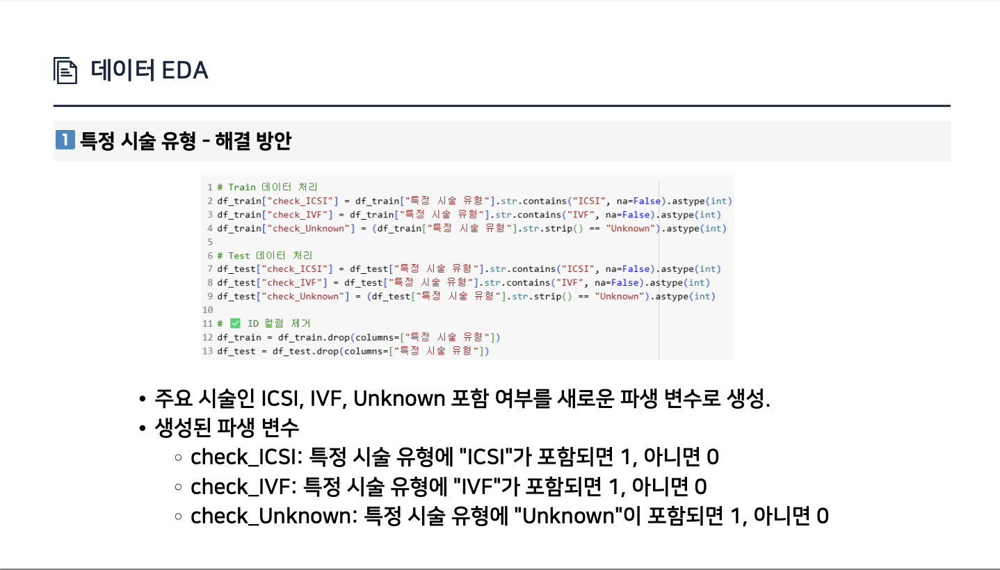

# 🧬 난임 환자 대상 임신 성공 여부 예측 🧬

## 🏁 대회 개요

---

## 📊 데이터 EDA

  

---

## 🧹 데이터 전처리

---

## ⚙️ 모델링 및 학습

  

---

## 📈 성능 결과

|               | Public     | Private |
|----------------|------------|------------|
| **AUC Score**  | **0.74218** | **0.74218** |
| **Rank**       | **13th**     | **33th**    |

---

## 🙌 팀원 소개
- 🧑‍💻 이원우  
- 🧑‍💻 손영진  
- 🧑‍💻 이단비
